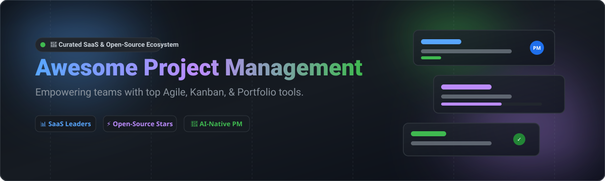

  

# 🚀 Awesome Project Management Software 🛠️

> **A curated list of top commercial SaaS platforms and modern open-source project management software, Agile tools, Kanban boards, and task planning solutions.**

---

## 📈 Market Size & Industry Dynamics

> [!NOTE]
> The global project management software market size is estimated at **$10.5 billion – $13.8 billion** and is growing at a CAGR of ~13%. The sector is **moderately fragmented**: while enterprise powerhouses like Microsoft, Atlassian (Jira), and Monday.com command massive market share, diverse specialized needs (e.g., local-first privacy, AI agent integration, developer-centric workflows, non-PM accessibility) support a vibrant ecosystem of both SaaS and open-source contenders.

---

## 📋 Table of Contents

- [🏢 SaaS / Hosted Platforms](#-saas--hosted-platforms)
- [⚡ Open-Source GitHub Projects](#-open-source-github-projects)
- [🤝 How to Contribute](#-how-to-contribute)
- [💖 Support](#-support)
- [⚠️ Disclaimer](#-disclaimer)
- [⭐ Star History](#-star-history)

---

## 🏢 SaaS / Hosted Platforms

Below is a curated comparison of leading enterprise and commercial SaaS project management platforms, sorted by **company market valuation / revenue** (descending).

| Platform | Valuation / Revenue | Starting Price | Free Tier / Trial Limit | Key Highlights & Best For |
| :--- | :--- | :--- | :--- | :--- |
| **[Microsoft Project](https://www.microsoft.com/microsoft-365/project/project-management-software)** 💼 | **$3.1 Trillion** (Market Cap) | $10.00 / user / month | 30-day free trial (Up to 25 users) | **Enterprise PPM Standard** — Resource allocation, Gantt charts, and deep Microsoft 365 integration. |
| **[Jira (Atlassian)](https://www.atlassian.com/software/jira)** 🎯 | **$48 Billion** (Market Cap) | $7.16 / user / month | **Free forever** for up to 10 users (2 GB storage) | **Agile Software Teams Reference** — Backlog management, Scrum/Kanban, CI/CD integrations. |
| **[Monday.com](https://monday.com/)** 📊 | **$13 Billion** (Market Cap) | $9.00 / seat / month | **Free forever** for up to 2 seats (Up to 3 boards) | **Customizable Work OS** — Visual workflow automation, dashboards, and client tracking. |
| **[Smartsheet](https://www.smartsheet.com/)** 📑 | **$8.4 Billion** (Acquired / Valuation) | $9.00 / user / month | **Free forever** for 1 user (Up to 2 sheets) | **Spreadsheet-Based Management** — Enterprise governance, automated workflows, and PMO reporting. |
| **[Workfront (Adobe)](https://www.workfront.com/)** 🏛️ | **$1.5 Billion** (Acquired by Adobe) | $30.00 / user / month (Custom quote) | 14-day enterprise trial upon request | **Enterprise Portfolio Management** — Complex corporate workflows, proofing, and asset management. |
| **[Asana](https://asana.com/)** 🚀 | **$3.0 Billion** (Market Cap) | $10.99 / user / month | **Free forever** for up to 10 users (Unlimited tasks/activity log) | **Marketing & Ops Standard** — List, board, timeline views, and cross-team goal tracking. |
| **[ClickUp](https://clickup.com/)** ⚡ | **$4.0 Billion** (Private Valuation) | $7.00 / user / month | **Free forever** for unlimited users (100 MB storage limit) | **All-In-One Productivity Platform** — Tasks, docs, whiteboards, goals, and built-in chat. |
| **[Wrike](https://www.wrike.com/)** 🛠️ | **$2.25 Billion** (Acquired valuation) | $9.80 / user / month | **Free forever** for unlimited users (200 MB storage limit) | **Agency & Marketing PM** — Cross-tagging, proofing, and work scheduling. |
| **[Basecamp](https://basecamp.com/)** ⛺ | **~$100 Million+** (Estimated ARR) | $15.00 / user / month (or $299/mo flat) | **Free 30-day trial** (Full featured, no credit card) | **Simplified Team Communication** — Message boards, to-do lists, and Campfire chat. |
| **[Teamwork](https://www.teamwork.com/)** 🤝 | **~$50 Million+** (Estimated ARR) | $5.99 / user / month | **Free forever** for up to 5 users (2 active projects) | **Client-Facing & Agency Focus** — Time tracking, client portals, invoicing, and profitability. |

---

## ⚡ Open-Source GitHub Projects

Self-hosted and open-source project management tools sorted by **GitHub Star Count** (descending). Star badges link directly to each repository's stargazers.

| Project | GitHub Stars Badge | License | Description & Key Strengths |
| :--- | :--- | :--- | :--- |
| **[Plane](https://github.com/makeplane/plane)** ✈️ |  | AGPL-3.0 | **Modern AI-Native Jira & Linear Alternative** — Work items, cycles (sprints), burn-down charts, modules, pages, and multi-layout views. |
| **[AppFlowy](https://github.com/AppFlowy-IO/AppFlowy)** 📝 |  | AGPL-3.0 | **Open-Source Notion Alternative** — Offline-first visual workspace with databases, kanban boards, tasks, and grid views. |
| **[OpenProject](https://github.com/opf/openproject)** 🏛️ |  | AGPL-3.0 | **Leading Enterprise Open-Source Suite** — Work packages, Gantt charts, Agile Scrum/Kanban, cost management, and time tracking. |
| **[Leantime](https://github.com/Leantime/leantime)** 🎯 |  | AGPL-3.0 | **PM for Non-Project Managers** — Designed with accessibility features for neurodiversity (ADHD, dyslexia), goal tracking, and strategic ideas. |
| **[Taskwarrior](https://github.com/GothenburgBitFactory/taskwarrior)** 💻 |  | MIT | **Command-Line Task Manager** — Ultra-fast, flexible CLI todo manager for power users and developers. |
| **[Focalboard](https://github.com/mattermost-community/focalboard)** 📋 |  | MIT / AGPL | **Multilingual Trello/Notion Alternative** — Self-hosted kanban boards, tables, and galleries maintained by the Mattermost community. |
| **[Taiga](https://github.com/kaleidos-ventures/taiga-back)** 🦎 |  | AGPL-3.0 | **Agile Scrum & Kanban Board** — Beautiful project management interface tailored specifically for Agile software developers. |
| **[Vikunja](https://github.com/go-vikunja/vikunja)** ⏱️ |  | AGPL-3.0 | **Self-Hosted Task Manager** — Hierarchical task lists, smart recurring tasks, kanban/gantt views, and Telegram bot integration. |
| **[Wekan](https://github.com/wekan/wekan)** 🎴 |  | MIT | **Collaborative Kanban Board** — Open-source Trello clone featuring real-time updates, swimlanes, and card dependencies. |
| **[Kanboard](https://github.com/kanboard/kanboard)** 📌 |  | MIT | **Minimalist Visual Task Board** — Minimalist PHP kanban software focusing on simplicity, drag-and-drop, and low resource overhead. |
| **[Paca](https://github.com/Paca-AI/paca)** 🤖 |  | MIT | **AI-Native PM with MCP Server** — Connects AI agents directly to project workspace data via Model Context Protocol. |
| **[Planka](https://github.com/plankanban/planka)** 🌊 |  | AGPL-3.0 | **Elegant Real-Time Kanban** — React and Redux based Trello tracking alternative for workgroups. |
| **[Redmine](https://github.com/redmine/redmine)** 🛑 |  | GPL-2.0 | **Classic Issue Tracker & PM** — Flexible Ruby on Rails web app with Gantt charts, wikis, forums, and multi-project support. |
| **[WorkBase](https://github.com/vocso-com/WorkBase)** 🔒 |  | Open-Source | **Local-First Desktop PM** — Offline Trello alternative with nested task progress rollups built with Tauri (Rust + Node). |
| **[4ga Boards](https://github.com/RARgames/4gaBoards)** 🌙 |  | MIT | **Modern Dark-Mode Kanban** — Real-time collaboration, collapsible todo lists, and multitasking tools. |
| **[Orangescrum CE](https://github.com/Orangescrum/opensource-community-edition)** 🍊 |  | AGPL-3.0 | **Self-Hosted Core PM** — PHP/CakePHP powered project management suite for team task tracking without seat caps. |

---

## 🤝 How to Contribute

Contributions are welcome! Please follow these simple guidelines:

1. 🍴 **Fork** this repository.
2. 📝 **Add/edit** entries in `README.md` following the exact table structure.
3. 🔗 **Include** official product link, license/valuation information, and concise descriptions.
4. 🚀 **Submit a Pull Request** with a brief summary of additions.

---

## 💖 Support

If you find this list helpful, please consider starring ⭐ the repository, sharing it with fellow team leads and developers, or contributing new options!

---

## ⚠️ Disclaimer

- This list is **community-curated** for information purposes.
- Valuations and pricing details reflect available market data and public filings.
- Self-hosted open-source software requires security hardening and routine backup strategy before production deployment.

---

## ⭐ Star History

---

Made with ❤️ for project managers, team leads, and sovereign open-source developers.

